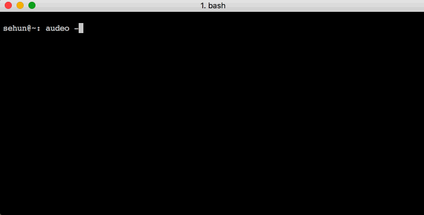
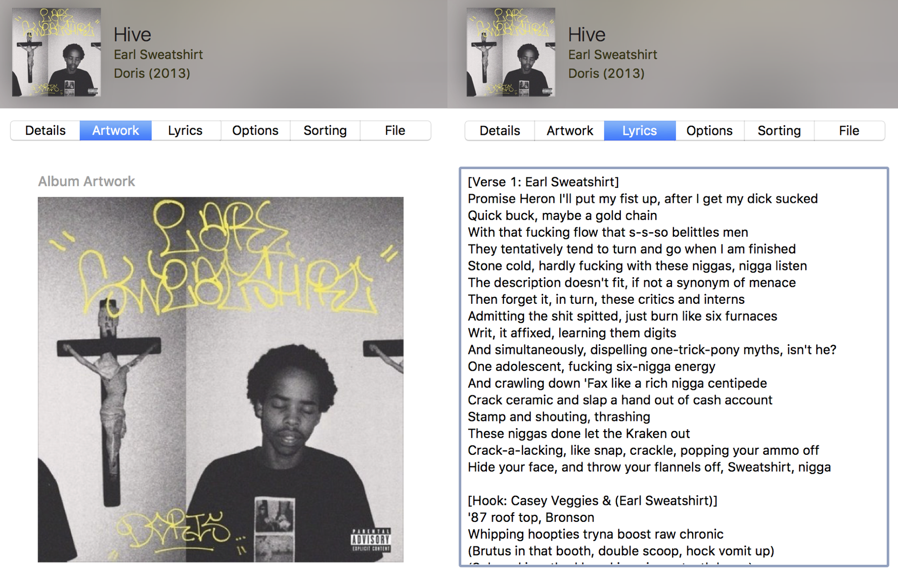

# Audeo

Audio is a python webscraping and web automation script that downloads a desired song and finds all related attributes such as album name, album artwork, and lyrics in order to create a complete mp3 file.

Audeo takes the song name and artist as input and searches for the link of song in the desired platform. Currently supported are [YouTube] & [SoundCloud]. On [RapGenius], Audeo will then look for the album name, album artwork, and lyrics. The song is downloaded from [anything2mp3] which extracts the mp3 file provided link. Finally, the mp3 file attributes will be set with the scraped information.

### Purpose

* To have my OCD satisfied
* To improve listening experience
* To make downloading music less tedious
* To allow better music library organization
* To combat limited data plan which restricts music streaming

### Dependencies
Audeo uses these python libraries to work properly:
* [BeautifulSoup] - HTML/XML parser for extracting data
* [eyeD3] - MP3 file attributes editor
* [Selenium] - Selenium
* [chromedriver] - Webdriver 

### Usage




### Options

```sh
usage: audeo [-h] [-y] [-s] [-p] [-i] [-c CUSTOM_LINK] [-l]
             [SONG_NAME_AND_ARTIST [SONG_NAME_AND_ARTIST ...]]

Script for downloading an mp3 file and corresponding metadata, ultimately to create a complete mp3 file containing all attributes.

positional arguments:
  SONG_NAME_AND_ARTIST

optional arguments:
  -h, --help            show this help message and exit
  -y, --youtube         Searches the song from YouTube
  -s, --soundcloud      Searches the song from SoundCloud (Includes album
                        artwork from SoundCloud)
  -p, --package         Gets entire mp3 package, including: mp3, lyrics, album
                        name, and album artwork. *Recommended only for well-
                        known songs from established artists*
  -i, --interactive     Interactive option. Displays all possible song
                        download options found. (Higher accuracy)
  -c CUSTOM_LINK, --custom-link CUSTOM_LINK
                        Custom user link option, allowing for user to enter
                        the link of the video or song
  -l, --lyrics-only     Shows lyrics on screen
```

### Future features
* Progress bars
* Downloading with custom link
* SoundCloud profile interaction
* Downloading song currently playing in tab
* Downloading all songs from a YouTube playlist 
* Further implementation for interactive option
* Extraction of mp3 from HypeM / DailyMotion/ Vimeo videos
* Hidden chromedriver windows using PhantomJS or virutal python env
* Migration to being a JavaScript application using Express.js, Angular,js, and Node.js

### Known bugs/flaws
* Bash forbidden characters in artist names will cause an error
	* ex: Joey Bad@$$, Ke$ha
* Eyed3 date error when setting attributes
	* does not affect validity mp3 file
* Error thrown when song not found on RapGenius
* Download file path must be edited manually 
* Custom link option is faulty and will throw an error
 
[//]: # 
   [BeautifulSoup]: <http://www.crummy.com/software/BeautifulSoup/bs4/doc/>
   [Selenium]: <http://selenium-python.readthedocs.org/>
   [YouTube]: <https://www.youtube.com/>
   [SoundCloud]: <https://www.soundcloud.com>
   [RapGenius]: <http://www.rapgenius.com>
   [anything2mp3]: <http://www.anything2mp3.com>
   [eyeD3]: <http://eyed3.nicfit.net/>
   [chromedriver]: <https://code.google.com/p/selenium/wiki/ChromeDriver>

  

